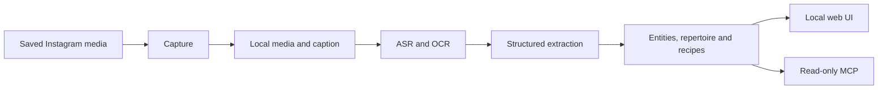
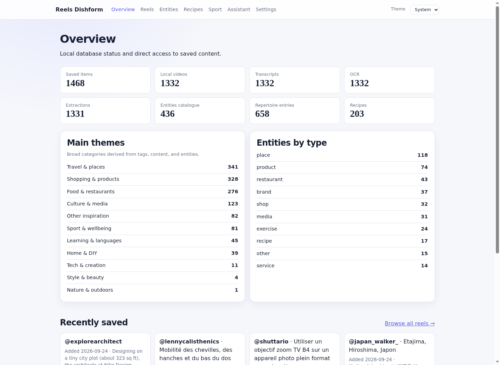
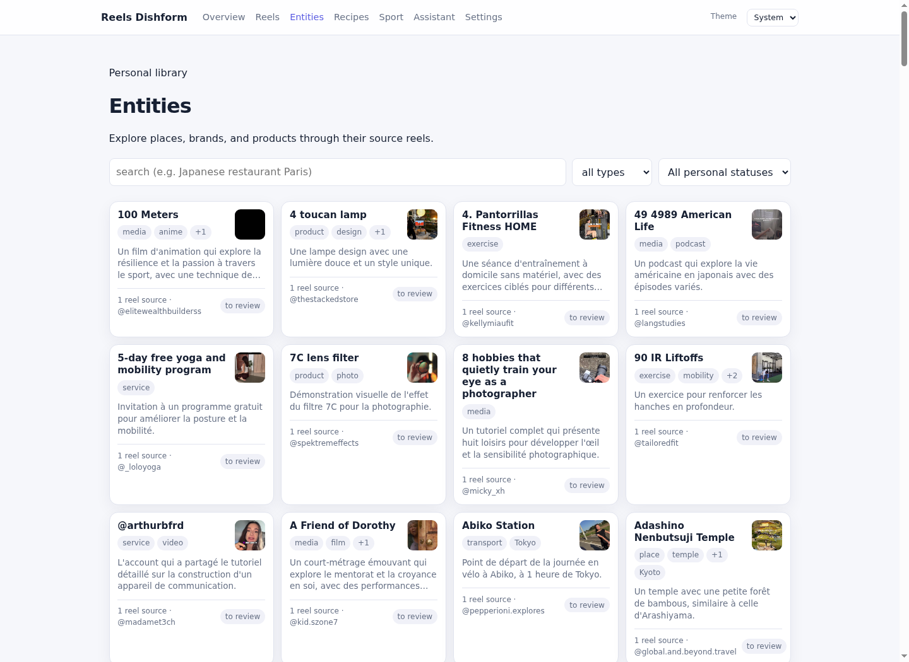

# Reels Platform

Turn saved Instagram reels and posts into a private, searchable local library.
Reels Platform keeps source evidence, extracts useful entities and revisit-worthy
content, then makes it available through a web interface, CLI, and read-only
MCP server.

> Local-first: SQLite, media files, personal feedback, and chat sessions stay on
> the machine. Model credentials and Instagram cookies are never exposed in the
> web interface.

## What it does

| Capability | Result |
|---|---|
| Capture | Tracks saved reels, posts, carousels, collections and scan history. |
| Enrich | Downloads local media, transcribes speech, and reads screen text. |
| Extract | Produces source-grounded entities, recipes, exercises, guides and tags. |
| Search | Browses entities, recipes, sport and reels from the web UI or SQLite-backed MCP. |
| Personal layer | Keeps personal entity status, recipe attempts and chat sessions separate from extracted facts. |
| Operate | Resumes stages safely and schedules a weekly local run with a selectable LLM profile. |

## Product flow



The original MP4 is never replaced. Proxies, posters, and first-frame previews
are replaceable local derivatives. A reel remains evidence for an entity; it is
not silently turned into a personal recommendation.

## Quick start

Requirements: Python 3.11–3.12, [uv](https://docs.astral.sh/uv/), `ffmpeg`, and
`yt-dlp`. Browsing an existing library does not need Instagram or LLM credentials.

```bash
make dev
```

Open [http://127.0.0.1:8420](http://127.0.0.1:8420). The installed local service
uses the same fixed address and port. `make dev` installs the locked development
and optional interface dependencies, creates a permission-restricted `.env` only
when it is absent, then runs the web app with automatic reload. It never starts
the pipeline. Use `make dev PORT=8421` or `make dev DB=/path/to/library.db` to
override the local port or database. Run `make init` once to also enable the Git
hooks, or `make doctor` to inspect the optional local capture and inference tools.

For capture or LLM-backed extraction, copy the documented local configuration
template first. It is ignored by Git and contains no credentials.

`make dev` and `make init` create `.env` from this template without overwriting
an existing file. Add credentials only when capture or a non-default inference
backend requires them.

```bash
# Inspect the local corpus and pipeline state
uv run reels status

# Run the test suite and curated regression checks
uv run pytest -q
uv run reels regression

# Expose read-only search tools to an external local agent
uv run --extra mcp reels-mcp
```

## Screenshots

<table>
  <tr>
    <td width="50%"></td>
    <td width="50%"></td>
  </tr>
  <tr>
    <td><em>Library overview</em></td>
    <td><em>Entity catalogue</em></td>
  </tr>
</table>

Screenshots show the owner’s populated local library with permission. They show
public source accounts and extracted source facts only; no cookies, credentials,
personal feedback, or chat history are included.

## Run and configure

The **Configuration** page controls the weekly user-systemd timer and selects a
predefined inference profile. Profiles support Codex Luna and Terra, Hermes, an
OpenAI-compatible API, or local Ollama. The selected profile applies to new
local chat and manual pipeline requests, as well as the next scheduled run;
secrets, cookies, and signed-in sessions remain outside the UI.

Pipeline stages are idempotent. A failed or interrupted item resumes narrowly;
normal operation does not replay the corpus.

## Future cloud deployment

The local-first deployment remains the reference. The cloud target keeps the
catalogue and personal data private while running scheduled work only when it is
needed.


PostgreSQL stores reels, entities, recipes, feedback, chat and pipeline state.
Private object storage holds original and derived media. The web starts private
behind a VPN or private network; a signed-URL CDN is an optional later media
optimisation. See the [full cloud deployment plan](docs/en/cloud-deployment.md).

## Development quality gates

Install the repository hooks once after cloning:

```bash
make hooks
```

The pre-commit hook rejects direct commits to `main`, checks staged Python files
for critical Ruff errors, and enforces Conventional Commit subjects. The pre-push
hook rejects direct pushes to `main`, validates `uv.lock`, then runs the critical
Ruff checks and full test suite. Use a feature branch for every change.

GitHub Actions runs the same validation for pull requests and for `main`.
When a GitHub remote is attached, protect `main` with a repository ruleset:
require a pull request, require the `CI / Validate` status check, block force
pushes and branch deletion, and allow no direct push. Do not require an approval
until there is another maintainer able to review it.

The project currently has historical Ruff findings outside the critical error
set. They are deliberately not made blocking here; resolving them is a separate
cleanup task before widening the lint gate.

## Documentation

| Topic | Link |
|---|---|
| Documentation index | [FR / EN](docs/README.md) |
| Domain and flow | [English](docs/en/domain-and-flow.md) |
| Data model | [English](docs/en/data-model.md) |
| Extraction quality | [English](docs/en/extraction-quality.md) |
| Web interface and local services | [English](docs/en/web-interface.md) |
| Read-only MCP | [English](docs/en/mcp.md) |
| Local setup and operation | [English](docs/en/local-setup.md) |

For agent working rules, see [AGENTS.md](AGENTS.md).
