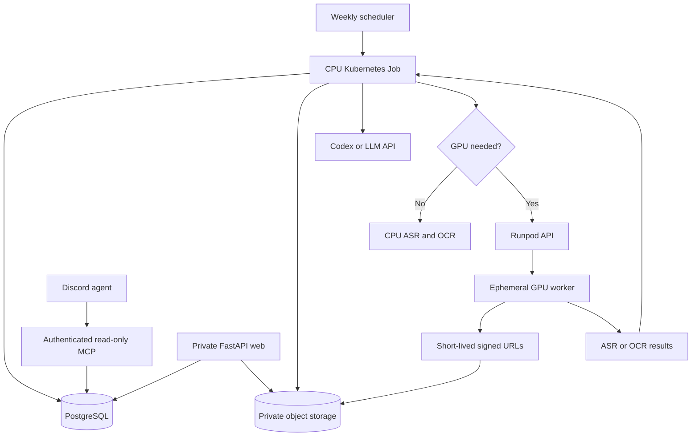

# Target cloud deployment

This document describes a future target. It does not change the local
deployment, existing data, or Instagram credentials.

## Goal

Run the platform autonomously at controlled cost while keeping media and the
catalogue private. PostgreSQL becomes the business source of truth; object
storage holds binary files only.

## Principles

- PostgreSQL stores reels, entities, recipes, personal feedback, chat and
  pipeline state.
- Private object storage stores originals and derived media; the database only
  stores references.
- A weekly Kubernetes Job resumes work and exits. CPU is the default; an
  ephemeral GPU is reserved for measured backlogs or exceptional batches.
- The GPU receives short-lived object-storage URLs, never direct PostgreSQL or
  permanent-secret access.
- The first cloud web deployment is private through a VPN or private network;
  a private CDN with signed URLs is an optional later optimisation.
- The existing Discord agent calls an authenticated, audited, read-only MCP.

## Migration order

1. Containerise without changing the local flow.
2. Migrate a verified SQLite copy to PostgreSQL.
3. Copy validated media to private object storage and verify restoration.
4. Deploy private web, CPU worker and authenticated MCP.
5. Add ephemeral GPU only after measuring CPU volume and cost.
6. Add a private CDN only when media traffic warrants it.
