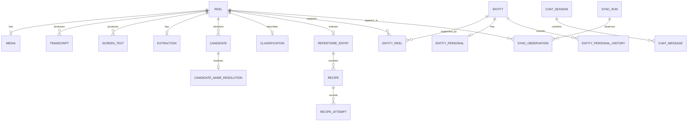

# Data model

This document describes the current model used by the pipeline, web UI and MCP.
The executable schema remains [src/storage/schema.sql](../../src/storage/schema.sql).

## Source core

| Object | Identity | Purpose |
|---|---|---|
| `reel` | `shortcode` | Saved Instagram post, caption and raw JSON. `kind` distinguishes reel, video, post and carousel. |
| `media` | `shortcode` | Local MP4 and derivatives: proxy, poster, first frame, hash and validation. |
| `reel_context` | `shortcode` | Location, tagged accounts, hashtags, mentions and links collected during sync. |
| `sync_run` / `sync_observation` | `id` / `(run_id, shortcode)` | Scan history and observed presence. |
| `stage_state` | `(shortcode, stage)` | Idempotent download, ASR, OCR and extraction resumption. |

`reel` is the capture source of truth. `first_seen_at` is immutable;
`last_seen_at` advances on every scan; `unsaved_at` records absence from the
saved feed.

## Evidence and extraction

| Object | Cardinality | Purpose |
|---|---|---|
| `transcript` | several versions per reel | ASR, language, segments and speech presence. |
| `screen_text` | several versions per reel | OCR, frames used and observations. |
| `extraction` | one active extraction per reel | model, prompt/context/code fingerprints, raw result, error and fiche. |
| `extraction_attempt` | several attempts per reel | detailed call provenance. |
| `classification` | one per reel | topic, actionability and saved reason. |
| `candidate` | zero to many per reel | observed name, type, attributes, evidence and verification state. |
| `candidate_name_resolution` | zero or one per candidate | `resolved` or `abstained` canonical decision. |

Evidence remains attached to its candidate. Re-extraction must not erase personal
feedback or name-resolution decisions.

## Business views

| Object | Cardinality | Purpose |
|---|---|---|
| `entity` | global catalogue | consolidated place, product, brand or service. |
| `entity_reel` | many-to-many | links an entity to supporting reels and source candidate. |
| `entity_alias`, `tag`, `entity_tag` | extensions | tolerant search and catalogue tags. |
| `repertoire_entry` | at most one per reel | revisit content: recipe, exercise, lesson, method, guide or inspiration. |
| `recipe` | many per entry | dish, cuisine, course, summary and evidence. |
| `recipe_attempt` | many per recipe | append-only personal experience. |

A catalogue entity can be supported by several reels. A repertoire entry remains
attached to its reel.

## Personal data and conversations

`entity_personal` holds current personal entity state; `entity_personal_history`
keeps every change. `chat_session` and `chat_message` keep web conversations.
These tables are never extraction evidence and must not change the catalogue.

## Indexes and projections

`entity_fts` and `repertoire_fts` accelerate search. `saved_reel_status`
projects pipeline state by reel. They are projections: direct writes bypass the
model invariants.
