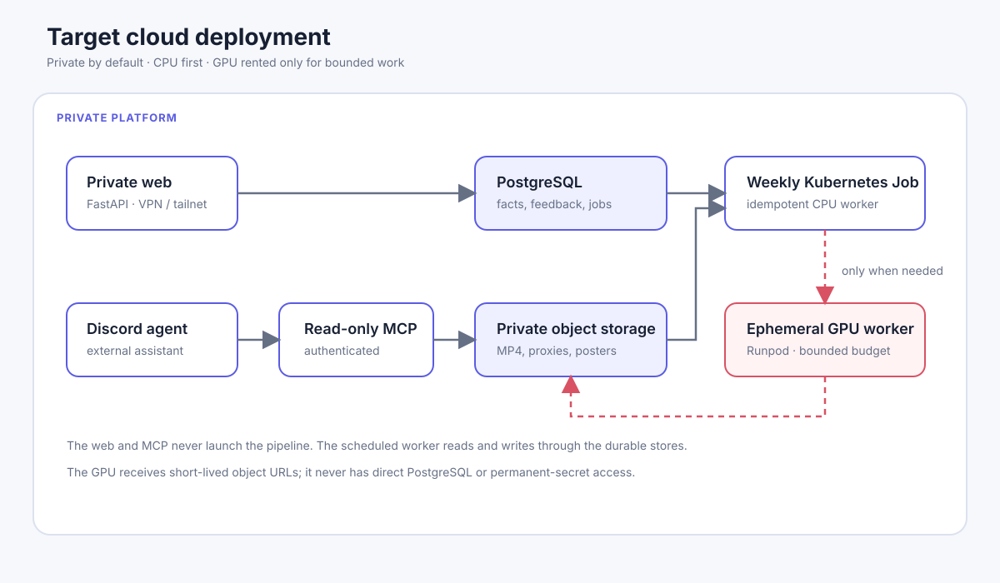

# Déploiement cloud cible

Ce document décrit une cible future. Elle ne modifie ni le déploiement local,
ni les données existantes, ni les identifiants Instagram.

## Objectif

Faire tourner la plateforme de façon autonome à coût maîtrisé, tout en gardant
les médias et le catalogue privés. PostgreSQL devient la source de vérité
métier ; le stockage objet contient uniquement les fichiers binaires.

## Données

| Donnée | Emplacement | Règle |
|---|---|---|
| Reels, entités, recettes, feedback, chat, états de pipeline | PostgreSQL | Source de vérité et sauvegardes transactionnelles. |
| MP4, proxy, poster, frames | Stockage objet privé | Référencés par la base, jamais accessibles publiquement par défaut. |
| Cookies Instagram, clés LLM, clé MCP | Gestionnaire de secrets | Jamais en base, image Docker ou interface web. |

## Accès web et médias

La première version cloud doit être privée : application FastAPI sur un VPS,
accessible seulement via un VPN ou un réseau privé tel que Tailscale. FastAPI
vérifie l'identité, puis peut servir ou proxyfier le média depuis le stockage
objet. Cette version ne demande pas de CDN.

Un CDN privé devient utile lorsque le trafic média surcharge le VPS. À ce stade,
l'application autorise chaque accès et produit une URL signée, courte, pour un
objet précis. Le bucket demeure privé et les URLs ne sont jamais conservées dans
PostgreSQL.

## Exécution et FinOps

Le worker est un Job Kubernetes : il est créé au run hebdomadaire, reprend les
éléments inachevés de façon idempotente, puis disparaît. Il n'existe pas de
worker permanent.

Le CPU est le défaut. Un GPU loué à la demande intervient seulement pour un
backlog ou un batch exceptionnel. Le worker GPU reçoit des URLs signées pour
une entrée et une sortie, jamais un accès direct à PostgreSQL ni aux secrets
permanents. Le contrôleur impose une concurrence GPU de un, une durée maximale
et un budget par run ; il termine le GPU même en cas d'échec du Job.

## MCP et agent Discord

L'agent Discord existant appelle un MCP sécurisé. Le MCP authentifie le client,
autorise chaque outil et reste lecture seule. Il expose la recherche, les fiches
et des références média temporaires, mais jamais SQL arbitraire, lancement de
pipeline ou publication Markdown. Un journal d'audit conserve l'identité, l'outil
et la date de chaque demande.

## Migration proposée

1. Documenter les contrats, puis containeriser sans modifier le flux local.
2. Exporter et importer une copie de SQLite dans PostgreSQL avec contrôles de
   comptage et de hash.
3. Mettre les médias validés dans le stockage objet privé et vérifier une
   restauration.
4. Déployer web privé, worker CPU et MCP authentifié.
5. Ajouter le GPU éphémère seulement après mesure du volume et du coût CPU.
6. Ajouter un CDN privé uniquement si les métriques média le justifient.
