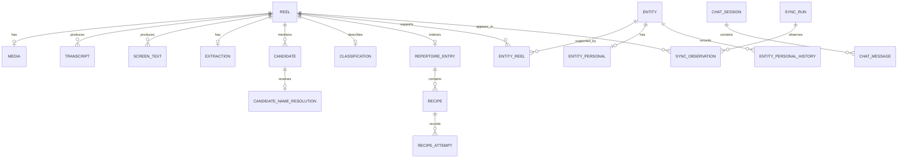

# Modèle de données

Ce document décrit le modèle courant vu par la pipeline, l’interface web et le
MCP. Le schéma exécutable reste [src/storage/schema.sql](../../src/storage/schema.sql).

## Noyau source

| Objet | Identité | Rôle |
|---|---|---|
| `reel` | `shortcode` | Publication Instagram sauvegardée, caption et JSON brut. `kind` distingue reel, vidéo, post et carrousel. |
| `media` | `shortcode` | MP4 local et dérivés : proxy, poster, premier frame, hash et validation. |
| `reel_context` | `shortcode` | Lieu, comptes tagués, hashtags, mentions et liens lus lors du scan. |
| `sync_run` / `sync_observation` | `id` / `(run_id, shortcode)` | Historique de chaque scan et présence observée. |
| `stage_state` | `(shortcode, stage)` | Reprise idempotente de download, ASR, OCR et extraction. |

`reel` est la source de vérité de capture. `first_seen_at` reste figé ;
`last_seen_at` évolue à chaque scan ; `unsaved_at` indique une absence du feed.

## Preuves et extraction

| Objet | Cardinalité | Rôle |
|---|---|---|
| `transcript` | plusieurs versions par reel | ASR, langue, segments et présence de parole. |
| `screen_text` | plusieurs versions par reel | OCR, frames utilisées et observations. |
| `extraction` | une extraction active par reel | modèle, empreintes prompt/contexte/code, résultat brut, erreur et fiche. |
| `extraction_attempt` | plusieurs tentatives par reel | provenance détaillée des appels. |
| `classification` | une par reel | sujet, actionnabilité et raison de sauvegarde. |
| `candidate` | zéro à plusieurs par reel | nom observé, type, attributs, preuves et statut de vérification. |
| `candidate_name_resolution` | zéro ou une par candidat | décision canonique `resolved` ou `abstained`. |

Les preuves restent attachées au candidat. Une extraction ne doit pas effacer les
feedbacks personnels ou la décision de résolution.

## Vues métier

| Objet | Cardinalité | Rôle |
|---|---|---|
| `entity` | catalogue global | lieu, produit, marque ou service consolidé. |
| `entity_reel` | relation N-N | rattache une entité aux reels qui la prouvent et au candidat origine. |
| `entity_alias`, `tag`, `entity_tag` | extensions | recherche tolérante et tags du catalogue. |
| `repertoire_entry` | au plus une par reel | contenu à revoir : recette, exercice, leçon, méthode, guide ou inspiration. |
| `recipe` | plusieurs par entrée | plat, cuisine, type, résumé et preuves. |
| `recipe_attempt` | plusieurs par recette | expérience personnelle append-only. |

Une entité catalogue est indépendante d’un reel unique : plusieurs sources
peuvent l’étayer. Une entrée de répertoire reste, elle, attachée à son reel.

## Données personnelles et conversations

`entity_personal` contient l’état courant personnel d’une entité ;
`entity_personal_history` conserve chaque changement. `chat_session` et
`chat_message` enregistrent les conversations de l’interface. Ces tables ne
sont jamais des preuves d’extraction et ne doivent pas modifier le catalogue.

## Index et projections

`entity_fts` et `repertoire_fts` accélèrent la recherche. `saved_reel_status`
projette les états de pipeline par reel. Ce sont des projections : les écrire
directement contourne les invariants du modèle.
